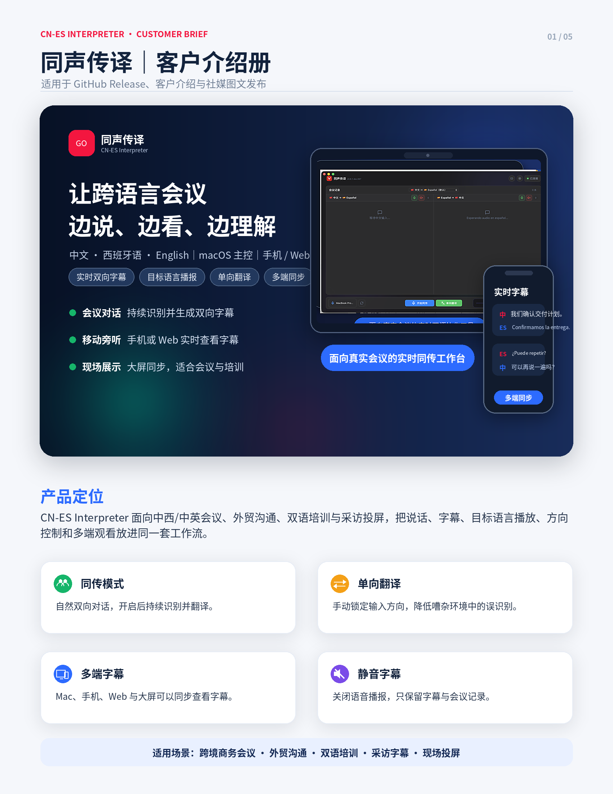
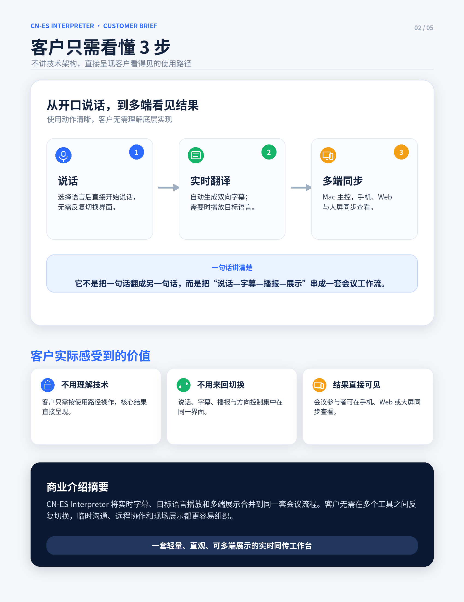
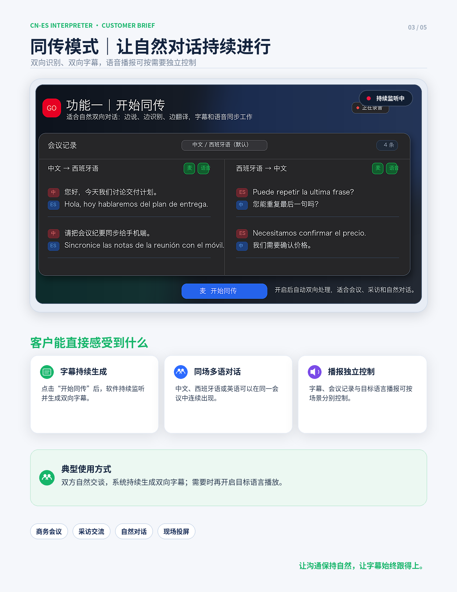
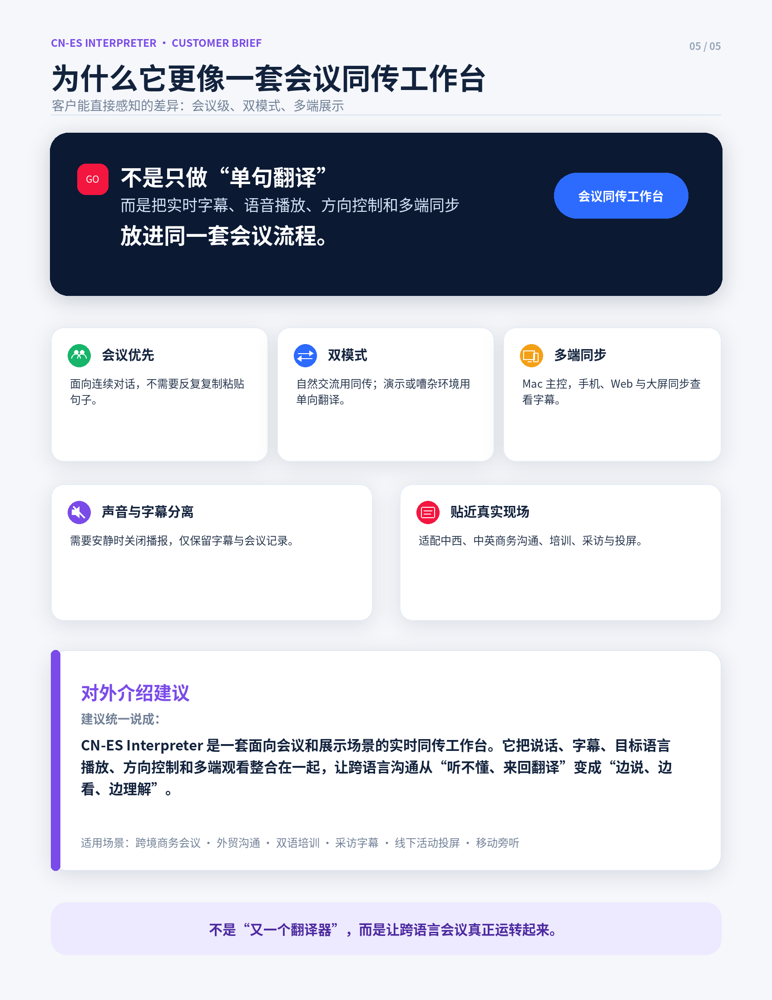

# CN-ES Interpreter 同声传译

CN-ES Interpreter（同声传译）是一款面向真实会议、跨境沟通和双语展示场景的实时传译工具。本发布项目只提供成品下载和使用说明，不包含源码、构建脚本、测试文件、密钥或内部开发资料。

## 下载

当前版本：`v0.10.0-dev.086`

- macOS Apple Silicon DMG：[`CN-ES-Interpreter-v0.10.0-dev.086-macos-arm64.dmg`](https://github.com/waitlogic-ops/CN-ES-Interpreter-Release/releases/download/v0.10.0-dev.086/CN-ES-Interpreter-v0.10.0-dev.086-macos-arm64.dmg)
- 备用 ZIP：[`CN-ES-Interpreter-v0.10.0-dev.086-macos-arm64.zip`](https://github.com/waitlogic-ops/CN-ES-Interpreter-Release/releases/download/v0.10.0-dev.086/CN-ES-Interpreter-v0.10.0-dev.086-macos-arm64.zip)
- 发布页面：[`v0.10.0-dev.086`](https://github.com/waitlogic-ops/CN-ES-Interpreter-Release/releases/tag/v0.10.0-dev.086)
- 校验文件：[`CHECKSUMS.txt`](CHECKSUMS.txt)

## 客户介绍图

## 适用场景

- 中西商务会议、外贸沟通和客户演示
- 双语课堂、线上培训和采访字幕
- 手机、Web 或大屏旁听字幕
- 需要“边说、边看、边理解”的跨语言现场

## 主要能力

- 同传模式：适合自然双向对话，持续识别、翻译并显示字幕。
- 单向翻译：适合演示、培训、问答或嘈杂现场，用户可以明确控制输入方向。
- 多端字幕同步：Mac 主控开始翻译后，手机、Web 和大屏端可以同步查看字幕。
- 声音与字幕分离：可关闭语音播放，只保留字幕和记录。
- 本地配置优先：用户自己的翻译、语音或大模型服务配置保留在本机。

## 安装提醒

1. 下载并打开 `CN-ES-Interpreter-v0.10.0-dev.086-macos-arm64.dmg`。
2. 将 `CN-ES Interpreter.app` 拖入“Applications / 应用程序”文件夹。
3. 首次运行时，根据 macOS 提示允许打开，并授予麦克风权限。
4. 如需使用翻译、语音或会议纪要能力，请在应用内配置对应服务。

这是开发预览版本，适合内部测试、客户演示和阶段性交付验证；对外大规模分发前建议继续完成正式签名、公证、安装包体验和授权服务侧闭环。
