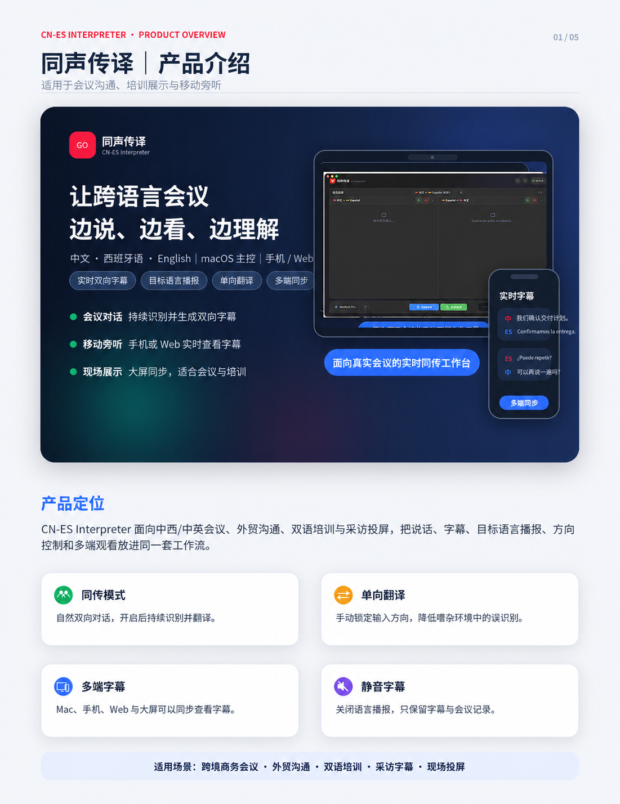
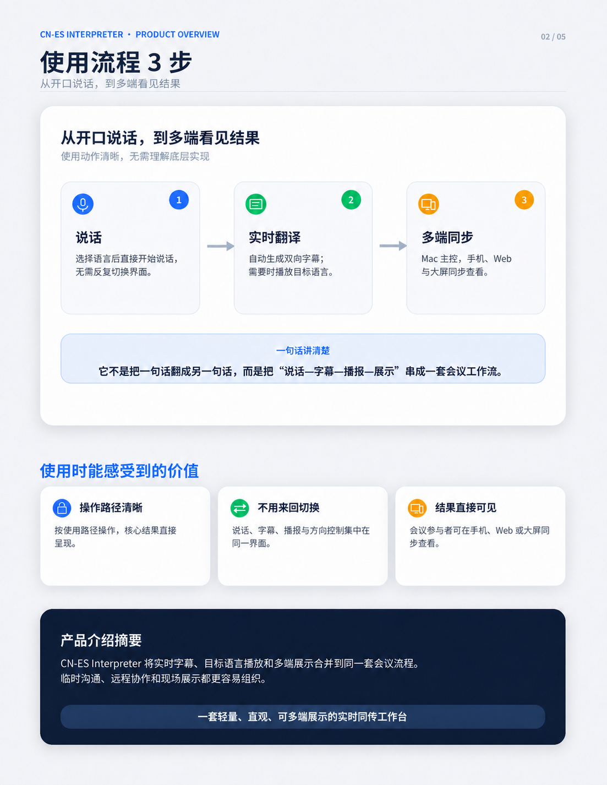

# CN-ES Interpreter 同声传译

CN-ES Interpreter 是一款面向会议、培训、商务沟通和现场展示的实时同声传译工具。它支持中文、西班牙语和英语场景，把实时字幕、目标语言播报、方向控制和多端观看整合在同一个工作台里。

## 下载

当前版本：`v0.10.0-dev.090`

- 推荐下载：[`CN-ES-Interpreter-v0.10.0-dev.090-macos-arm64.dmg`](https://github.com/waitlogic-ops/CN-ES-Interpreter-Release/releases/download/v0.10.0-dev.090/CN-ES-Interpreter-v0.10.0-dev.090-macos-arm64.dmg)
- 备用 ZIP：[`CN-ES-Interpreter-v0.10.0-dev.090-macos-arm64.zip`](https://github.com/waitlogic-ops/CN-ES-Interpreter-Release/releases/download/v0.10.0-dev.090/CN-ES-Interpreter-v0.10.0-dev.090-macos-arm64.zip)
- 完整发布页：[`v0.10.0-dev.090`](https://github.com/waitlogic-ops/CN-ES-Interpreter-Release/releases/tag/v0.10.0-dev.090)
- 文件校验：[`CHECKSUMS.txt`](CHECKSUMS.txt)

## 产品预览






## 适合做什么

- 跨语言商务会议和外贸沟通
- 双语课堂、培训和采访字幕
- 现场演示、移动旁听和大屏投放
- 需要连续字幕、语音播报和多端同步的沟通场景

## 主要能力

- **实时同传**：持续识别说话内容，生成双语字幕。
- **单向翻译**：在演示、培训或嘈杂环境中手动锁定输入方向。
- **多端同步**：Mac 主控开始后，手机、Web 和大屏可以同步查看字幕。
- **语音与字幕分离**：可按现场需要关闭播报，只保留字幕和记录。
- **本地配置**：翻译、语音和大模型服务配置保留在本机。

## 安装

1. 下载并打开 `CN-ES-Interpreter-v0.10.0-dev.090-macos-arm64.dmg`。
2. 将 `CN-ES Interpreter.app` 拖入“Applications / 应用程序”文件夹。
3. 首次运行时，根据 macOS 提示允许打开，并授予麦克风权限。
4. 按应用内提示配置所需的翻译、语音或会议纪要服务。

## 使用说明

本文面向普通使用者，覆盖首次 API 配置、跨端字幕同步、局域网访问、同声传译和单向翻译。

### 1. 首次启动与 API 配置

首次打开应用时，会出现“首次启动 API 配置”窗口。需要配置两类 API：

- 豆包 / 火山引擎同声传译 2.0 旧版 API：负责实时语音识别、翻译和语音播报；
- DeepSeek API：负责生成会议纪要 / AI 总结。

如果已经配置过，输入框可以留空，应用会继续保留本机已有配置。

#### 豆包同声传译 2.0 旧版 API 获取教程

常用入口：

- 火山引擎控制台：[https://console.volcengine.com/](https://console.volcengine.com/)
- 豆包 / 火山同声传译 2.0 旧版 API 文档：[https://docs.volcengine.com/docs/6561/1756902?lang=zh](https://docs.volcengine.com/docs/6561/1756902?lang=zh)
- 火山音频技术应用管理说明：[https://www.volcengine.com/docs/6489/75565?lang=zh](https://www.volcengine.com/docs/6489/75565?lang=zh)

获取步骤：

1. 登录火山引擎控制台。
2. 进入音频技术 / 语音技术相关服务。
3. 找到同声传译、AST 或应用管理入口。
4. 创建或选择一个同声传译应用。
5. 复制应用里的 `App ID`。
6. 复制应用里的 `Access Token` / `Access Key`。
7. 回到软件配置窗口，填写：
   - 火山 App ID；
   - 火山 Access Key。
8. 点击“测试火山”，通过后保存配置。

注意：本项目字段名叫 `VOLC_ACCESS_KEY`，但火山控制台里可能显示为 Access Token、Access Key 或类似名称。请确认 App ID 和 Access Key 来自同一个同声传译应用。

#### DeepSeek API 获取教程

常用入口：

- DeepSeek 开放平台：[https://platform.deepseek.com/](https://platform.deepseek.com/)
- DeepSeek API Keys 页面：[https://platform.deepseek.com/api_keys](https://platform.deepseek.com/api_keys)
- DeepSeek API 文档：[https://api-docs.deepseek.com/zh-cn/](https://api-docs.deepseek.com/zh-cn/)

获取步骤：

1. 登录 DeepSeek 开放平台。
2. 打开 API Keys 页面。
3. 新建 API Key。
4. 复制以 `sk-` 开头的 Key。
5. 回到软件配置窗口，填写：
   - DeepSeek API Key；
   - DeepSeek 模型，默认 `deepseek-v4-flash`。
6. 点击“测试 DeepSeek”，通过后保存配置。

### 2. 跨端字幕同步与局域网访问

macOS App 启动后会在本机后台启动服务，默认端口是 `3000`。其他手机、平板、电脑或投屏设备只要和这台 Mac 在同一个局域网，就可以打开网页查看同步字幕。

访问地址不是固定的，每个人、每个 Wi‑Fi 下都可能不同。格式是：

```text
http://本机 IP 地址:3000
```

例如本机 IP 地址是 `192.168.1.23`，其他设备就访问：

```text
http://192.168.1.23:3000
```

如果网络环境变化，IP 也可能变化。可以按下面方式重新确认：

- macOS：系统设置 → Wi‑Fi → 当前网络 → IP 地址；
- 或在终端查看当前局域网 IP。

#### 跨端字幕使用方式

1. 在 Mac 上打开 `同声传译 / CN-ES-Interpreter`。
2. 确认右上角显示“已连接”。
3. 在同一 Wi‑Fi / 局域网下，用手机、平板或另一台电脑访问：

   ```text
   http://本机 IP 地址:3000
   ```

4. 右上角“字幕同步”图标默认开启。
5. Mac 端开始同传后，其他端即使不点击“开始同传”，也会同步显示字幕。
6. 如果某台设备不想接收其他端字幕，可以关闭右上角“字幕同步”图标；关闭后只显示本机产生的字幕。

说明：

- 局域网网页主要用于跨端看字幕、投屏和会议旁观。
- 如果要在手机浏览器上直接使用麦克风，部分浏览器可能要求 HTTPS 安全环境；仅看字幕通常不需要。
- 如果用 Tailscale、反向代理或 HTTPS 域名访问，请以实际域名为准。

### 3. 同声传译（双向）使用教程

同声传译适合双方自然对话。系统会同时监听两个方向，并把符合条件的结果显示到对应栏目。

#### 启动双向同传

1. 选择语言对：
   - 中文 ↔ Español；
   - 中文 ↔ English。
2. 选择麦克风。
3. 点击底部蓝色按钮“开始同传”。
4. 启动后按钮变为红色“停止同传”。
5. 对话过程中，中文和西语 / 英语都可以直接说，系统会自动分配到对应方向。

#### 声音开关

每个方向都有独立喇叭按钮：

- 喇叭开启：识别、翻译并播放目标语言语音；
- 喇叭关闭：继续识别和翻译，但不播放语音，后台走静音优先线路。

#### 方向开关

每个方向都有独立麦克风按钮：

- 中文方向开启：允许中文 → 西语 / 英语；
- 中文方向关闭：不处理中文方向音频；
- 西语 / 英语方向开启：允许西语 / 英语 → 中文；
- 西语 / 英语方向关闭：不处理该方向音频。

两个方向都开启时才是自动双向同传。只开一个方向时，系统进入手动单通道路由。

### 4. 单向翻译使用教程

单向翻译适合“一个人控制发言方向”的场景，例如演示、培训、客服、现场沟通。

#### 开启单向翻译

1. 点击底部绿色“单向翻译”按钮。
2. 开启后按钮会进入复合状态：
   - 桌面端：用空格键切换方向；
   - 手机 / 平板端：用按住按钮切换方向。

#### 桌面端空格控制

在单向翻译模式下：

- 按住空格：显示“松开西语”或“松开英语”，当前走中文 → 西语 / 英语通道；
- 松开空格：显示“按住中文”，当前走西语 / 英语 → 中文通道。

如果当前语言对选择为中英，按钮会自动把“西语”换成“英语”。

#### 手机和平板端按住按钮

没有键盘的设备使用屏幕按钮：

- 按住按钮：走中文 → 西语 / 英语通道；
- 松开按钮：走西语 / 英语 → 中文通道。

#### 关闭单向翻译

单向翻译开启后支持滑动关闭：

1. 在单向翻译按钮上向左滑动；
2. 出现“向左滑动关闭”提示；
3. 滑动完成后退出单向翻译。

### 5. 会议纪要 / AI 总结

有会议记录后，点击会议记录区域右上角的 AI 总结按钮，即可使用 DeepSeek 生成会议纪要。

AI 总结会尽量输出：

- 会议概要；
- 关键要点；
- 决策与结论；
- 待办事项；
- 关键词。

如果 DeepSeek API 未配置，实时同传仍然可用，但会议纪要 / AI 总结不可用。

### 6. 常见问题

#### 其他设备打不开网页

检查：

- Mac 和其他设备是否在同一个 Wi‑Fi / 局域网；
- Mac App 是否已经打开；
- 右上角是否显示已连接；
- 地址是否写成 `http://本机 IP 地址:3000`；
- macOS 防火墙是否拦截了本应用或 Python 后端。

#### 手机端不能使用麦克风

局域网 HTTP 页面在部分浏览器上不能直接调用麦克风。解决方式：

- 只把手机作为字幕显示端；
- 或使用 HTTPS / Tailscale 域名访问；
- 或继续用 Mac App 作为主录音端。

#### 字幕不同步

检查右上角“字幕同步”图标是否开启。字幕同步关闭后，该设备只显示本机字幕。

## 介绍素材

上方 5 张产品介绍图仅用于主页展示，不作为版本附件上传。
